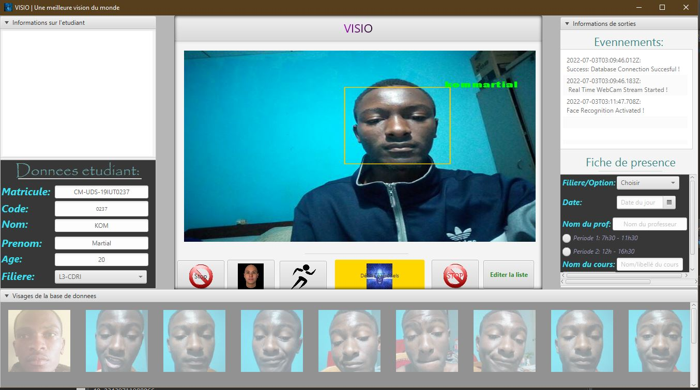

# Projet Visio
<p align="center">
 </div>
</p>

VISIO is a Smart Computer Vision Application with various functionalities. I have tried to put as many Machine Learning tools as possible into one single Application for greater productivity.

<p align="center">
 </div>
</p>

## KEY FEATURES
* Auto Attendance system Using Real Time Face Recognition
* Face Trainer
* Motion Detection
* Trained Faces Image Gallery View
* Persistent Storage for Trained Faces Image Using Database

## TECHNOLOGY USED
* Core Java
* JavaCV (wrapper of Opencv )
* JavaFX
* MySQL
* Maven

# Installation Guide
For more informations contact Tamaroas-Dev from facebook or send a mail to <b>martialkom123@gmail.com</b>
## Maven Dependencies
```xml
     <dependency>
  	    <groupId>org.bytedeco</groupId>
  	    <artifactId>javacv-platform</artifactId>
  	    <version>1.3.2</version>
      </dependency>
  
      <dependency>
           <groupId>mysql</groupId>
           <artifactId>mysql-connector-java</artifactId>
           <version>5.1.14</version>
      </dependency>
  ```
  
### Required Software
To properly run this Application on your System, At first you need to download and install the following software:

 * An implementation of **Java SE** 7 or newer:
   * **JDK**  http://www.oracle.com/technetwork/java/javase/downloads/index.html
 
 * An implementation of **JavaFX**: (Follow The Installation Instruction)
   * **JavaFX**  https://docs.oracle.com/javafx/2/installation/jfxpub-installation.htm

 * An implementation of **JavaCV**: (Follow The Installation Instruction)
   * **JavaCV**  https://github.com/bytedeco/javacv
   
 * To Connect MySQL with Java, You will need a connector: (Follow the installation instruction)
   * **MySQL Connector Java**  https://dev.mysql.com/downloads/connector/j/5.1.html
  
 * An implementation of **JavaFX Scene Builder**: (Follow The Installation Instruction)
   * **JavaFX Scene Builder**  https://docs.oracle.com/javafx/scenebuilder/1/installation_1-0/jsbpub-installation_1-0.htm
 

## Database Settings 
* Open MySQL on XAMPP then Create a New Database & name it **visio** 
* Now import attached **visio.sql** to the  **visio** Database
* Or Create a New Schema(Table)
```sql

CREATE TABLE IF NOT EXISTS `face_bio` (
 `code` int(4) NOT NULL,
  `first_name` varchar(15) DEFAULT NULL,
  `last_name` varchar(15) DEFAULT NULL,
  `age` int(11) DEFAULT NULL,
  `filiere` varchar(15) NOT NULL,
  `matricule` varchar(20) DEFAULT NULL
) ENGINE=InnoDB AUTO_INCREMENT=1 DEFAULT CHARSET=latin1;

CREATE TABLE `cours` (
  `id` int(11) NOT NULL AUTO_INCREMENT,
  `nom_C` varchar(35) DEFAULT NULL,
  `filiere` varchar(15) DEFAULT NULL,
  `departement` varchar(30) DEFAULT NULL,
  `nom_Prof` varchar(40) NOT NULL,
  PRIMARY KEY (`id`)
)ENGINE=InnoDB AUTO_INCREMENT=1 DEFAULT CHARSET=utf8mb4 COLLATE=utf8mb4_0900_ai_ci;

CREATE TABLE `presence` (
  `id_c` int(11) NOT NULL,
  `matricule_E` varchar(30) DEFAULT NULL,
  `dateP` varchar(20) DEFAULT NULL,
  `periode` varchar(30) DEFAULT NULL
) ENGINE=InnoDB DEFAULT CHARSET=utf8mb4 COLLATE=utf8mb4_0900_ai_ci;

```

* Now Open src/application/Database.java and provide your MySQL DB credintials
```java
package application;

import java.sql.*;
import java.util.ArrayList;
import java.util.List;

class Database {
	.
  .
  .

	public final String Database_name = "Your Database";
	public final String Database_user = "Your Database user Name";
	public final String Database_pass = "Your Database Password";

	.
	.
	.
```

       

 


